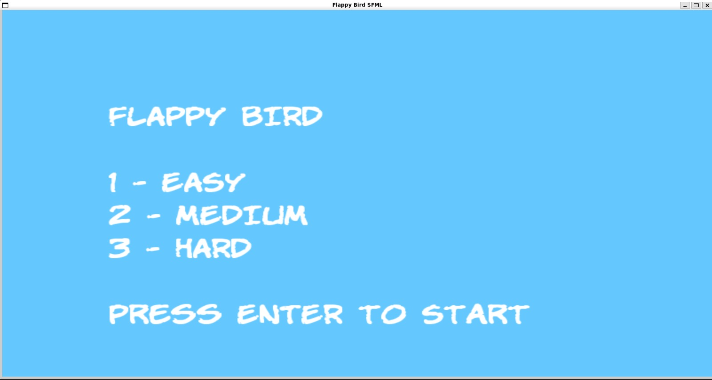
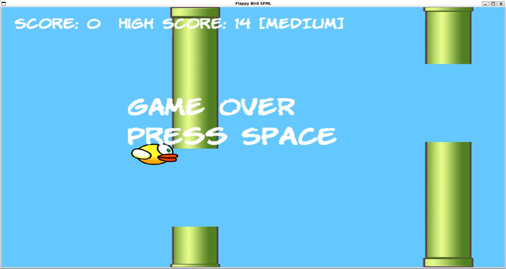

# Flappy Bird (SFML)

A scratch C++ recreation of Flappy Bird, with one twist most clones skip: pipes that actually move.



## Overview

Classic rules i.e gravity constantly pulls the bird down, you tap Space to flap upward and you're trying to slip through pipe gaps without clipping the top or bottom. Where this version differs from a basic tutorial clone is the difficulty system: on Medium and Hard, pipe gaps don't just get smaller and they oscillate up and down on a sine wave while scrolling toward you, so timing your flap becomes a moving target instead of a fixed one.

High scores are saved to disk (`highscore.txt`) and reloaded on launch, so progress actually persists between sessions.



## Features

- **3 difficulty levels** that change both gap size and pipe behavior:
  - **Easy** — large static gap, no movement
  - **Medium** — smaller gap, gentle vertical drift
  - **Hard** — tight gap, faster and wider oscillation
- **Per-pipe motion variance** — each pipe gets a randomized phase, speed and amplitude for its sine wave movement, so no two runs feel identical
- **Persistent high score** — written to and read from `highscore.txt` via simple file I/O
- **Forgiving hitbox margin** — collision rectangles are trimmed in from the sprite's visual bounds so near misses don't feel unfair
- **Menu → Playing state machine** driven by a single `GameState` enum, keeping input handling and rendering logic cleanly separated by state
- **Audio feedback** for flapping, collisions and game over

## Tech Stack

- **C++17**
- **SFML** (`Graphics` + `Audio` modules)

## Getting Started

### Requirements

- A C++17-capable compiler
- [SFML](https://www.sfml-dev.org/download.php) (2.5+) installed and linkable

### Build (Linux, g++)

```bash
g++ q2.cpp -o FlappyBird -lsfml-graphics -lsfml-window -lsfml-system -lsfml-audio
./FlappyBird
```

Run it from the project root so it can find `graphics/`, `sound/` and `highscore.txt` via their relative paths.

A prebuilt Linux binary (`game2`) is also included in the repo if you just want to run it without compiling.

### Build (Windows)

Add `q2.cpp` to a project set up with SFML (Visual Studio or Code::Blocks both have standard SFML setup guides), link the SFML libraries and build.

## Controls

| Key | Action |
|---|---|
| `1` / `2` / `3` | Select Easy / Medium / Hard (menu) |
| `Enter` | Start game |
| `Space` | Flap / restart after game over |

## How the Moving Pipes Work

Each pipe stores a base Y position plus a phase, speed and amplitude. Every frame, its actual gap position is recalculated as `baseY + sin(time * speed + phase) * amplitude`. On Easy, amplitude is 0, so pipes are static. On Medium and Hard, that sine term is what makes the gaps drift . It's a small bit of math doing a lot of the work in making the harder difficulties feel meaningfully different rather than just "smaller gap, same game."

## Possible Next Steps

- Animated bird sprite (currently a static texture)
- Parallax scrolling background
- Online/shared leaderboard instead of a local text file

## Conclusion

Built solo as a C++/SFML project and the physics, collision, the state machine and the pipe oscillation system were all written from scratch. Sound effects are placeholder/meme audio used during development and not meant to represent final production audio.
